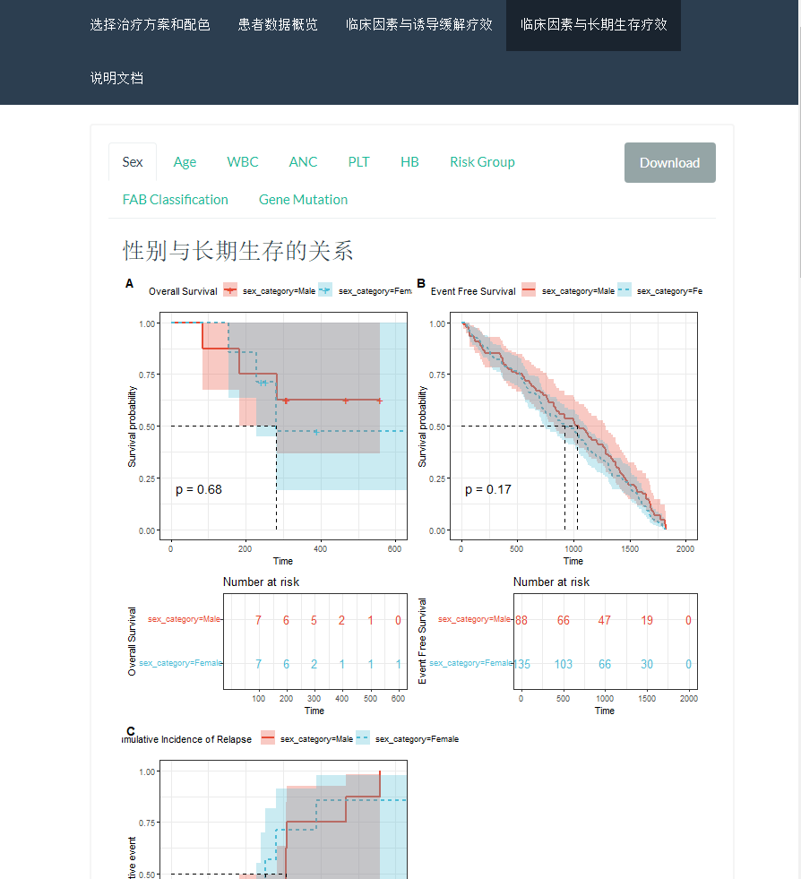
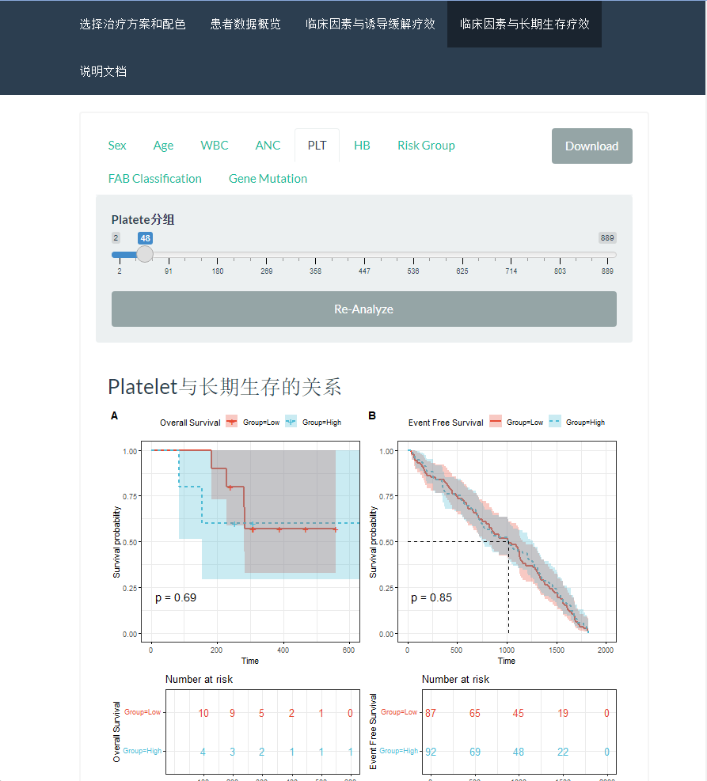

# clinicalAnalysisShinyApp

### Introduction

This repository hosts shiny code which is used to analyze clinical data from leukemia patients.
The current version is v2.
Screen shoots are shown below:

